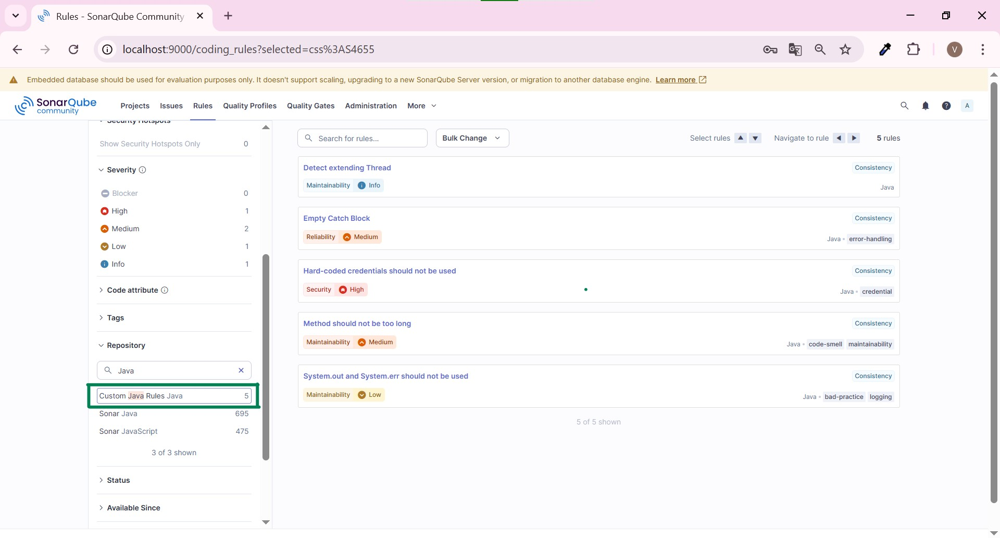

# SonarQube Custom Java Rules Plugin

Project ini merupakan implementasi **custom static analysis rules untuk Java** menggunakan **SonarQube Plugin API**.  
Tujuan utama project ini adalah untuk pembelajaran dan portfolio, khususnya memahami bagaimana SonarQube menganalisis source code Java menggunakan **AST (Abstract Syntax Tree)** serta bagaimana membuat, mendaftarkan, dan mengaktifkan custom rule di SonarQube.

> ⚠️ **Disclaimer**  
> Project ini dibuat untuk **learning & portfolio purpose**.  
> Seluruh rule yang dibuat merupakan studi kasus umum.

---

## Tujuan Project

- Memahami cara kerja SonarQube Java Analyzer
- Mempelajari konsep AST (Abstract Syntax Tree) pada Java
- Membuat custom rule menggunakan `IssuableSubscriptionVisitor`
- Mengemas rule sebagai plugin SonarQube (`.jar`)
- Mengintegrasikan custom rule ke Quality Profile
- Memvalidasi hasil analisis melalui:
  - SonarQube Web UI
  - IDE (SonarLint)

---

## Daftar Custom Rule

| Rule Key | Nama Rule | Deskripsi | Severity |
|--------|----------|-----------|----------|
| `extend-thread` | Detect Class Extending Thread | Mendeteksi class yang extend `Thread` secara langsung | INFO |
| `empty-catch-block` | Empty Catch Block | Mendeteksi blok `catch` kosong yang mengabaikan exception | MAJOR |
| `hardcoded-credential` | Hard-coded Credential | Mendeteksi credential yang ditulis langsung di source code | CRITICAL |
| `long-method` | Long Method | Mendeteksi method dengan jumlah baris terlalu panjang | MAJOR |
| `no-system-out` | No System.out / System.err | Mendeteksi penggunaan `System.out` dan `System.err` | MINOR |

---

## Gambaran Arsitektur

```
Java Source Code
        ↓
SonarQube Java Analyzer
(Build AST)
        ↓
Custom Java Rules Plugin
(AST Visitor)
        ↓
SonarQube Issues
(Web UI & IDE)
```

---

## Konsep Utama yang Digunakan

- Abstract Syntax Tree (AST)
- SonarQube Plugin API
- `IssuableSubscriptionVisitor`
- Java Tree API (`ClassTree`, `MethodTree`, `CatchTree`, dll)
- RulesDefinition & Quality Profile
- Static Code Analysis

---

## Teknologi yang Digunakan

- Java
- SonarQube
- SonarQube Plugin API
- Maven
- Docker & Docker Compose
- SonarLint (IDE Integration)

---

## Cara Menjalankan Project

### 1️⃣ Build Plugin
```bash
mvn clean package
```

Output plugin:
```
target/sonarqube-custom-java-rules-<version>.jar
```

---

### 2️⃣ Menjalankan SonarQube (Docker Compose)
```bash
docker-compose up -d
```

---

### 3️⃣ Install Plugin ke SonarQube
Copy file `.jar` ke:
```
extensions/plugins/
```

Lalu restart SonarQube:
```bash
docker restart sonarqube
```

---

### 4️⃣ Aktivasi Rule
1. Masuk ke SonarQube Web UI
2. Buka menu **Rules**
3. Filter berdasarkan repository **Custom Java Rules**
4. Aktifkan rule di **Quality Profile**
5. Assign Quality Profile ke project

---

### 5️⃣ Analisis Project Java
```bash
mvn sonar:sonar
```

Issue dari custom rule akan muncul di:
- SonarQube Web UI
- SonarLint (IDE)

---

## Project Testing

Disediakan project Java terpisah sebagai **test project** yang berisi contoh pelanggaran rule seperti:
- Class yang extend `Thread`
- Empty catch block
- Hard-coded credential
- Method terlalu panjang
- Penggunaan `System.out.println`

Tujuan pemisahan project:
- Validasi rule lebih jelas
- Mudah direplikasi
- Aman untuk public repository

---

## Evidence / Bukti Implementasi

Evidence yang ditampilkan dalam project ini:
- Custom rule yang sudah terdaftar 
  
- Detail rule definition
  
- Issue terdeteksi di IntelliJ (SonarLint)
  
- Issue terdeteksi di SonarQube Web UI
  

---

## Pembelajaran yang Didapat

- Cara SonarQube membangun dan membaca AST Java
- Perbedaan rule metadata dan rule logic
- Integrasi rule ke Quality Profile
- Alur static analysis end-to-end
- Sinkronisasi analisis IDE dan server

---

## Catatan Keamanan

Project ini:
- Tidak menggunakan credential asli
- Tidak mengandung rule proprietary
- Tidak melanggar kebijakan perusahaan mana pun

Seluruh contoh bersifat **generic & edukatif**.

---

## 👤 Author

**Vini Jumatul**  

---

## Lisensi

Project ini dibuat untuk **pembelajaran dan portfolio pribadi**.
